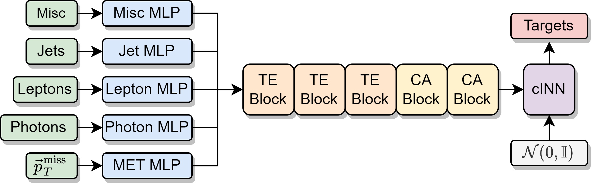

# NuFlows

This repository facilitates the steps required the produce and evaluate
conditional normalising flows for neutrino regression in events with multiple neutrinos.
- Associated papers: https://arxiv.org/abs/2207.00664
- Associated papers: https://arxiv.org/abs/2307.02405

## Setup

1) Setup the environment.
    - This project was tested with python 3.9.
    - You can use the requirement.txt file to setup the appropriate python packages.
    - Alternatively use the docker build file to create an image which can run the package.
2) Download the data.
    - The datafiles are too large and thus are not stored in this repository.
    - You can find them on Zenodo:
        - doi: 10.5281/zenodo.8113516

## Configuration

- This package uses Hydra and OmegaConf.
- The main config file is `train.yaml` which composes all others to generate a single run config
    - In this file you can specify the `network_name`, `seed`, etc.
    - More specific settings are found in one of the other config folders:
        - `callbacks`:
            - Provides a collection of `lightning.pytorch.callbacks` to run during training.
        - `datamodule`:
            - Defines the data files used for training and testing.
            - Also which coordinates are used for the object kinematics.
        - `hydra`:
            - Configures the hydra package for running, does not need to be changed.
        - `loggers`:
            - By default we use `Weights and Biases` for logging.
                - You will need to make a free account here: `https://wandb.ai/` and put your username in the `entity` entry of this yaml file.
        - `model`:
            - Configures the model architecture and hyperparameters for training.
            - By default the transformer + normalising flow is used.
        - `paths`:
            - Define the paths to the data download here as well as the desired save directory for the models.
        - `trainer`:
            - Configuration for the PyTorch Lightning `Trainer` class.

## Running

We provide 3 executable scripts
1) `train.py`
    - Compiles the run config as described above and trains the model.
    - Will save checkpoints based on the `paths.output_dir` key.

2) `export.py`
    - Creates an output `.h5` file containing neutrino candidates for each event in the models test set.

3) `plot.py`
    - Loads the test set data and a model's exported neutrinos.
    - More can be done here but by default we simply plot the model and truth neutrino energy as well as the reconstructed top mass.
